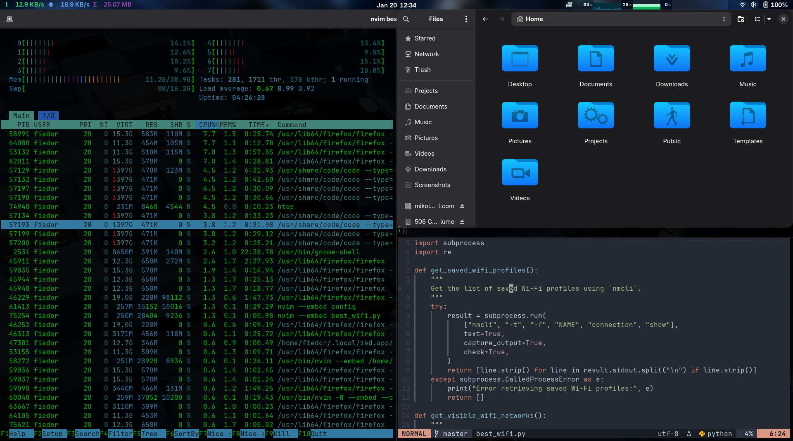

# Fedora Dotfiles & Setup

Automated Fedora Workstation setup with GNOME, Ghostty terminal, Neovim, and custom configurations. Uses GNU Stow for symlink management.



## 🚀 Quick Install

```bash
git clone https://github.com/YOUR_USERNAME/dotfiles.git ~/Projects/config
cd ~/Projects/config
./install.sh
```

Then **log out and log back in** to apply GNOME extensions and settings.

## ✨ What's Included

### 🖥️ Terminal & Shell
- **Ghostty** - GPU-accelerated terminal with splits, tabs, custom theme
- **Zsh** - Shell with Oh My Zsh framework
- **Powerlevel10k** - Fast, customizable prompt theme
- **Zsh Plugins** - autosuggestions, syntax-highlighting

### 📝 Editors
- **Neovim** - Full Lua config with lazy.nvim plugin manager
- **VS Code** - Settings, keybindings & extensions list (auto-installed)
- **Zed** - Settings, keybindings & custom theme ([moje.json](zed/.config/zed/themes/moje.json))

### 🐧 GNOME Desktop
- **14 Shell Extensions** - See [GNOME Extensions](#-gnome-extensions) section
- **Custom Keybindings** - Quick folder access, app launching
- **GNOME Terminal Profile** - Colors, fonts, behavior
- **Run-or-Raise** - Focus/launch apps with keyboard shortcuts
- **Kora Icon Theme** - Beautiful icon set

### 🔧 System Configuration
- **keyd** - Key remapping daemon (Home/End, PgUp/PgDn swap for ThinkPads)
- **Package Lists** - DNF/APT packages for quick reinstall

### 🔤 Fonts
- **MesloLGS NF** - Patched for Powerlevel10k
- **JetBrainsMono Nerd Font** - For terminals & editors

### 🛠️ Custom Scripts (48+)
- Clipboard, file management, git shortcuts
- Bluetooth, audio, network utilities
- Development servers, system tools
- See [Custom Scripts](#custom-scripts-projectsscripts) section

### 📦 CLI Tools (auto-installed)
```
eza, bat, ripgrep, fd-find, btop, fastfetch, fzf,
nmap, wireshark, rustscan, neovim, git, stow, curl
```

## 🧩 GNOME Extensions

All extensions are automatically installed and configured:

| Extension | Description |
|-----------|-------------|
| **Advanced Alt-Tab** | Enhanced window switcher with preview & customization |
| **Blur My Shell** | Beautiful blur effects for panel, overview & menus |
| **Burn My Windows** | Animated window open/close effects (fire, glitch, etc.) |
| **Clipboard Indicator** | Clipboard history manager in top bar |
| **EasyScreenCast** | Screen recording with webcam & audio support |
| **Just Perfection** | Customize GNOME shell behavior & visibility |
| **Launch New Instance** | Always launch new app windows (override grouping) |
| **Monitor (Astra)** | System monitor: CPU, RAM, GPU, network, temps |
| **Net Speed Simplified** | Network speed indicator in top bar |
| **Soft Brightness** | Software-based brightness control overlay |
| **System Monitor Next** | Resource usage graphs in panel |
| **Tactile** | Tiling window manager with keyboard shortcuts |
| **Transparent Shell** | Make top panel transparent |
| **User Themes** | Load custom shell themes |

Extensions are copied from [gnome/gnome-shell-extensions/](gnome/gnome-shell-extensions/) and auto-enabled during installation.

## 🎯 Features

### Keybindings
- `Ctrl+Alt+T` - Toggle/focus Ghostty terminal
- `Ctrl+Alt+H` - Open home folder
- `Ctrl+Alt+P` - Open Projects folder
- `Ctrl+Alt+F` - Open Downloads
- `Ctrl+Alt+Z` - Screenshots folder
- `Ctrl+Alt+X` - Screencasts folder

### Ghostty Terminal
- `Ctrl+D` - Split pane right
- `Ctrl+Shift+D` - Split pane down
- `Ctrl+W` - Close current pane
- `Ctrl+Shift+Arrow` - Navigate between panes

### Installed Tools
```bash
# Modern CLI replacements
ls → eza (with icons)
cat → bat (syntax highlighting)
find → fd
grep → rg (ripgrep)
top → btop
fetch → fastfetch

# Network & Security
nmap, wireshark, rustscan

# Development
neovim, git, gcc, make, python3, ruby, nodejs
```

### Custom Scripts (~/Projects/scripts)

Essential productivity scripts linked to `~/Projects/scripts/`:

**File & Clipboard Management:**
| Script | Description |
|--------|-------------|
| `cpld [n]` | Copy last `n` files from Downloads to current directory (default: 1) |
| `path` | Copy current working directory path to clipboard |
| `copy` | Pipe content to clipboard (e.g., `cat file \| copy`) |
| `gitpas` | Copy GitHub PAT to clipboard (from `~/Projects/kredki/github`) |

**Development & Servers:**
| Script | Description |
|--------|-------------|
| `live_server` | Start browser-sync dev server with live reload |
| `redirect_ports` | Port forwarding utility |
| `pull` / `push` | Quick git pull/push shortcuts |

**System & Hardware:**
| Script | Description |
|--------|-------------|
| `sluchawki` | Toggle Bluetooth headphones connection (Edifier) |
| `muza <query>` | Search & play YouTube audio via yt-dlp + mpv (use `--loop` to repeat) |
| `weather` | Show weather forecast for Warsaw (wttr.in) |
| `touchpad-off` | Disable touchpad |
| `trackPointSpeed` | Adjust ThinkPad TrackPoint sensitivity |

**Network & Security:**
| Script | Description |
|--------|-------------|
| `best_wifi.py` | Find strongest WiFi network |
| `speedtest` | Run internet speed test |
| `vpnL` / `vpnTHM` | Connect to VPN profiles |
| `wifipasy` | Retrieve saved WiFi passwords |


...and many more! Browse [bashScripts/](bashScripts/) for the full collection.

### ThinkPad Key Remapping
Uses [keyd](https://github.com/rvaiya/keyd) to remap keys for better ThinkPad experience:
- `Home` → `End`
- `End` → `Home`  
- `Insert` → `Delete`
- `PgUp/PgDn` swapped for more intuitive navigation

Config: [scripts/keyd/default.conf](scripts/keyd/default.conf)

## 📁 Structure

```
~/Projects/config/
├── install.sh           # Main installation script
├── bashScripts/         # Custom scripts (linked to ~/Projects/scripts)
├── code/                # VS Code settings & extensions
├── ghostty/             # Terminal config (.config/ghostty)
├── gnome/               # GNOME settings & extensions
├── nvim/                # Neovim configuration (.config/nvim)
├── run-or-raise/        # Run-or-raise shortcuts (.config/run-or-raise)
├── scripts/             # Package lists & utilities
├── zed/                 # Zed editor config & themes (.config/zed)
└── zsh/                 # Zsh + Oh My Zsh config
```

## 🎨 Customization

### Themes & Appearance

**VS Code**
- Custom settings and keybindings
- Dark theme configuration
- Extensions list auto-installed

**Zed Editor**
- Custom theme: [moje.json](zed/.config/zed/themes/moje.json)
- Vim mode enabled
- Custom keybindings

**GNOME**
- Kora icon theme
- Custom shell theme support via user-theme extension
- Transparent panel with blur effects

### Run-or-Raise Extension

Efficient window switching and app launching with keyboard shortcuts. Instead of opening new instances, it raises existing windows or launches apps if not running.

**Installation:**
```bash
sudo dnf install run-or-raise  # Fedora
# or
sudo apt install run-or-raise  # Ubuntu/Debian
```

**Configured Shortcuts:**
- `Ctrl+Alt+T` - Ghostty terminal
- `Ctrl+Alt+V` - VS Code
- `Ctrl+Alt+Z` - Zed editor
- `Ctrl+Alt+P/H/A/X/F` - File manager locations

Config: [run-or-raise/.config/run-or-raise/shortcuts.conf](run-or-raise/.config/run-or-raise/shortcuts.conf)

**Note:** After cloning, update paths in `shortcuts.conf` to match your username.

## 🔧 GNU Stow - Dotfile Management

All configurations are centralized in `~/Projects/config/` and symlinked to their proper locations using [GNU Stow](https://www.gnu.org/software/stow/).

**How it works:**
- Each folder (nvim, zsh, ghostty, etc.) mirrors the structure under `~/.config/`
- Stow creates symlinks from `~/Projects/config/folder/.config/app` → `~/.config/app`
- Edit files in one place, changes apply everywhere
- Easy to version control and sync across machines

**Manual Stow Usage:**

```bash
# Stow individual configs
stow -vt ~ nvim          # Links ~/.config/nvim
stow -vt ~ ghostty       # Links ~/.config/ghostty
stow -vt ~ run-or-raise  # Links ~/.config/run-or-raise
stow -vt ~ zsh           # Links ~/.zshrc

# Restow (update symlinks after changes)
stow -Rvt ~ nvim ghostty zsh

# Unstow (remove symlinks)
stow -Dt ~ nvim
```

## 🔄 Updating Dotfiles

After making changes, commit and push:
```bash
cd ~/Projects/config
git add -A
git commit -m "Update configs"
git push
```

On another machine, just pull and re-run install.sh:
```bash
cd ~/Projects/config
git pull
./install.sh
```

## 📋 Supported Distributions

- **Fedora** (primary target)
- **Ubuntu/Debian/Pop!_OS**
- **macOS** (partial support)

